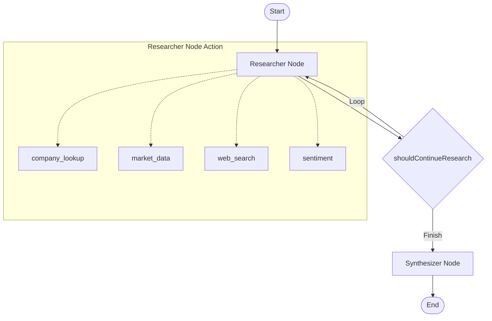

# AI Investment Research Agent

An autonomous AI research assistant built to gather public market data, scrape financial web sources, analyze news sentiment, and generate a structured "invest-or-pass" verdict. The application is built using **Next.js (App Router)**, **LangGraph**, and the **Google GenAI SDK** (running the **Gemma 4** model as the primary reasoning agent). 

This version runs completely on free/public APIs, avoiding paid keys for data retrieval or web searching.

---

## Overview

This application automates the workflow of an equity research analyst. Given a company name, the agent performs the following tasks:
1. **Ticker Resolution**: Resolves the company name to a public ticker symbol on a major exchange.
2. **Financial Data Gathering**: Fetches key metrics (P/E ratio, market cap, margins, cash flow) from Yahoo Finance.
3. **Valuation and Competitive Moat Research**: Searches the web for recent earnings, guidance, competitor comparisons, and analyst ratings.
4. **Sentiment Analysis**: Scrapes recent news headlines and runs sentiment analysis to quantify public tone.
5. **Verdict Synthesis**: Automatically scores the company across five dimensions (Financial Health, Valuation, Market Position, News Sentiment, and Growth Signals) and outputs a structured investment recommendation.

The user interface displays the live steps of the agent's reasoning (via Server-Sent Events) alongside interactive charts, comparative peers, bull/bear cases, and dynamic recommendation gauges.

---

## How It Works

### Approach & Architecture
The core engine is built on **LangGraph**, utilizing a cyclic state graph that coordinates two main nodes:



1. **Researcher Node (Agentic Reasoning)**: 
   - Powered by `gemma-4-31b-it` using Gemini API.
   - Evaluates the current state (the retrieved data) and decides which tool to call next using native function calling.
   - Executes tools sequentially (up to a limit of 5 loops) until it has gathered sufficient evidence or runs out of iterations.
2. **Synthesizer Node**:
   - Compiles all compiled research notes.
   - Computes weighted scores and generates a structured verdict.
   - Outputs a validated JSON response matching a strict Zod schema.

### Scoring Model
The synthesizer evaluates the company out of 100 points, using the following weights:

| Dimension | Weight | Description |
| --- | --- | --- |
| **Financial Health** | 30% | Balances balance sheet liquidity, profit margins, debt ratios, and free cash flows. |
| **Valuation** | 20% | Measures trailing/forward P/E, P/S, and EV/EBITDA ratios relative to history and peers. |
| **Market Position** | 20% | Evaluates competitive moat, market share, pricing power, and primary competitors. |
| **News Sentiment** | 15% | Measures news headline tone (bullish vs. bearish) from the last 30 days. |
| **Growth Signals** | 15% | Evaluates recent revenue growth rates, product pipelines, and TAM expansion. |

### Verdict Mappings
- **80 – 100**: `STRONG_BUY`
- **65 – 79**: `BUY`
- **45 – 64**: `HOLD`
- **25 – 44**: `PASS`
- **0 – 24**: `AVOID`

---

## Key Decisions & Trade-offs

* **Google GenAI SDK & Gemma 4 Reasoning**: I chose the native `@google/genai` SDK and `gemma-4-31b-it` because of its high-fidelity structured outputs, native tool-calling capabilities, and cost efficiency.
* **Resilient Yahoo Finance Fallback**: Yahoo Finance's detailed statistics endpoints (`quoteSummary`) can block requests or return empty fields. If it fails, our tool automatically queries a public 1-day chart endpoint to retrieve basic prices and 52-week ranges. It labels the response with `isFallback: true` and includes a warning notice. The **Researcher Agent** detects this warning and dynamically initiates a DuckDuckGo `web_search` for missing financials (e.g. PEG ratio, margins), ensuring data availability.
* **DuckDuckGo HTML Scraping**: To avoid Tavily or Google Search API paywalls, web search parses DuckDuckGo HTML results using `cheerio`. *Trade-off*: HTML parsing is vulnerable to layout changes, but it is free and requires zero API key setup.
* **Sentiment Layering**: The sentiment tool calls the Hugging Face Inference API (`cardiffnlp/twitter-roberta-base-sentiment-latest`). If Hugging Face credentials are not provided or if the API is rate-limited, the system falls back to a deterministic, keyword-matching algorithm, preventing execution blocks.
* **Server-Sent Events (SSE)**: We use SSE for streaming logs from the LangGraph execution directly to the UI. This provides a live, interactive logging feed showing exactly what tools the agent is calling in real time.

---

## How to Run

### 1. Prerequisites
- [Node.js](https://nodejs.org/) (v18 or higher recommended)
- A Google Gemini API Key

### 2. Installation
Clone the repository and install the dependencies:
```bash
npm install
```

### 3. Environment Setup
Copy the example environment file and configure your API keys:
```bash
cp .env.local.example .env.local
```

Open `.env.local` and fill in the values:
```env
# Required: Gemini API Key for Gemma reasoning engine
GEMINI_API_KEY=your_gemini_api_key_here
GEMMA_MODEL=gemma-4-31b-it

# Optional: Hugging Face Token for headline sentiment analysis
HF_TOKEN=your_hugging_face_token_here
HF_SENTIMENT_MODEL=cardiffnlp/twitter-roberta-base-sentiment-latest

# App URL (usually http://localhost:3000 in dev mode)
NEXT_PUBLIC_APP_URL=http://localhost:3000
```

### 4. Running the Development Server
Start Next.js in development mode:
```bash
npm run dev
```
Open [http://localhost:3000](http://localhost:3000) in your browser.

---

## Example Runs

Here are two actual verdicts generated by the agent during testing:

### 1. NVIDIA (Ticker: NVDA) — STRONG_BUY (95% Confidence)
```json
{
  "recommendation": "STRONG_BUY",
  "confidenceScore": 95,
  "scores": {
    "financialHealth": 98,
    "valuation": 82,
    "marketPosition": 96,
    "newsSentiment": 92,
    "growthSignals": 97
  },
  "bullCase": "Rubin architecture triggers a second wave of AI spending focused on agentic AI, while the new Arm-based PC chips capture 10-15% of the laptop market by 2027. This combination drives the stock toward the $240-$260 range.",
  "bearCase": "Aggressive China export restrictions permanently sever a primary revenue stream, and hyperscalers successfully transition to internal silicon (TPUs/Trainium), compressing margins and driving the price back to the $150 support level.",
  "keyMetrics": [
    "Q1 FY2027 Revenue: $81.6B",
    "YoY Revenue Growth: 85%",
    "FY2026 Net Income: $120.07B",
    "Forward P/E: 23x",
    "FCF: $97B"
  ],
  "reasoning": "NVIDIA is currently operating at a scale and efficiency rarely seen in semiconductor history. The company's financial performance is not just growing, but accelerating, as evidenced by the Q1 FY2027 revenue beat of $81.6B (85% YoY growth). The sheer magnitude of the Data Center segment, contributing $75.2B in a single quarter, underscores a dominant market position protected by the CUDA software moat. From a valuation perspective, the market is surprisingly conservative. A forward P/E of 23x for a company growing revenue at 85% suggests that the 'AI bubble' concerns are decoupled from the actual fundamental earnings power of the firm. The massive $120.07B net income for FY2026 provides a fortress balance sheet, allowing NVIDIA to aggressively return capital to shareholders via an $80B buyback and a significant dividend hike. Strategically, NVIDIA is moving from being a 'chip vendor' to an 'AI stack owner.' The recent announcement of Arm-based PC chips for Dell, HP, and ASUS is a critical pivot. By entering the PC market, NVIDIA is attacking the CPU incumbents (Intel/AMD) on their home turf, leveraging AI inference at the edge. Furthermore, the move to the Rubin architecture signals a shift toward 'Agentic AI,' which requires significantly more compute than simple pattern recognition, ensuring a long runway for hardware refreshes. Given the visibility into 2026-2027 revenue and the expansion into the PC ecosystem, we assign a STRONG_BUY rating.",
  "dataFreshness": "Data current as of June 28, 2026, incorporating Q1 FY2027 results reported May 20, 2026.",
  "decisionBreakdown": {
    "financialHealthReasoning": "Exceptional liquidity and profitability. FY2026 recorded $215.9B in revenue with a staggering $120.07B in net income (approx. 55% net margin). Free Cash Flow is reported at $97B, enabling a massive $80B share repurchase authorization and a dividend increase from $0.01 to $0.25 per share.",
    "valuationReasoning": "Trading at a forward P/E of 23x, which is highly attractive given the current growth trajectory. With Q1 FY2027 revenue growing 85% YoY, the PEG ratio is significantly below 1.0, suggesting the stock is undervalued relative to its earnings expansion.",
    "marketPositionReasoning": "Maintains a near-monopoly in AI accelerators via the CUDA ecosystem. Data Center revenue reached $75.2B in Q1 FY2027 (up 92% YoY). Strategically expanding the moat by entering the PC chip market with Arm-based silicon via partners like Dell, HP, and Microsoft, directly threatening Intel and AMD.",
    "newsSentimentReasoning": "Highly positive sentiment driven by the Q1 FY2027 beat ($81.6B revenue) and the announcement that the Rubin superchip is in full production to support 'Agentic AI' models.",
    "growthSignalsReasoning": "Revenue growth is accelerating (85% YoY in Q1 FY2027). The transition from Blackwell to Rubin architecture and the strategic pivot into PC CPUs represent significant TAM expansion beyond the data center."
  },
  "catalysts": [
    "Full-scale rollout of Rubin superchips for Agentic AI",
    "First shipment of Arm-based AI PC laptops from Dell and HP",
    "Execution of the $80B share buyback program",
    "Further upgrades to fair value estimates from major analysts"
  ],
  "risks": [
    "Geopolitical instability and US-China trade sanctions",
    "Potential cyclical peak in AI infrastructure spending",
    "Competitive pressure from in-house silicon at AWS, Google, and Meta"
  ],
  "timeHorizon": "LONG_TERM",
  "targetPriceRange": {
    "low": 210,
    "high": 240,
    "basis": "Based on Morningstar's raised fair value estimate of $225 and a 23x forward P/E applied to projected FY2027 earnings growth."
  },
  "comparablePeers": [
    "AMD",
    "INTC",
    "AVGO"
  ]
}
```

### 2. Tesla (Ticker: TSLA) — HOLD (82% Confidence)
```json
{
  "recommendation": "HOLD",
  "confidenceScore": 82,
  "scores": {
    "financialHealth": 78,
    "valuation": 52,
    "marketPosition": 70,
    "newsSentiment": 48,
    "growthSignals": 85
  },
  "bullCase": "Successful mass production of Robotaxis and widespread regulatory approval of FSD by 2027, coupled with the 16GW energy storage rollout, could drive the stock toward the $500+ range.",
  "bearCase": "Continued erosion of EV market share and a regulatory crackdown on FSD/Autopilot following crash probes could trigger a re-valuation as a standard auto company, potentially dropping the price toward $290.",
  "keyMetrics": [
    "Q1 2026 Revenue: $22.39B",
    "Q1 2026 Gross Margin: 21%",
    "Q1 2026 Operating Cash Flow: $3.9B",
    "Energy Capacity Deal: 16GW"
  ],
  "reasoning": "Tesla is currently in a high-stakes transitional phase, shifting its identity from a high-growth EV manufacturer to an AI and sustainable energy conglomerate. From a financial perspective, the company remains healthy; Q1 2026 gross margins of 21% and $3.9 billion in operating cash flow demonstrate that Tesla can still generate significant capital despite a 'struggling' core automotive business. However, the market is increasingly pricing TSLA not on cars sold, but on the execution of its AI roadmap. The bullish thesis is anchored in the energy pivot and autonomy. The June 2026 deal with Sunrun and Renew Home to provide 16GW of power for data centers is a critical signal that Tesla's energy business is becoming a scalable, institutional-grade revenue stream independent of vehicle sales. Similarly, the focus on Robotaxi mass production represents a potential paradigm shift in margins. Conversely, the bear case is becoming more tangible. The loss of global volume leadership is a systemic threat, and the entry of OpenAI into the robotics space directly challenges Tesla's Optimus narrative. More concerning are the 'crash probes and lawsuit headlines' which create a regulatory overhang that could delay the deployment of FSD, the primary catalyst for the AI valuation. At $379.71, the stock is fairly valued relative to its current volatility and the 'valuation gap' mentioned in research. It is too expensive to be a 'Strong Buy' based on current automotive headwinds, but too rich in intellectual property and energy infrastructure to be a 'Sell'. We maintain a HOLD rating.",
  "dataFreshness": "Data retrieved as of June 28, 2026, incorporating Q1 2026 earnings and June 2026 news events.",
  "decisionBreakdown": {
    "financialHealthReasoning": "Q1 2026 results show solid resilience with $22.39 billion in revenue and a gross profit of $4.72 billion, yielding a 21% gross margin. Operating cash flow remains strong at $3.9 billion, though aggressive R&D and CapEx spending are pressuring near-term liquidity.",
    "valuationReasoning": "The stock is trading at $379.71, roughly in the middle of its 52-week range ($288.77 - $498.83). There is a reported 'five-fold valuation gap' between its value as a traditional automaker and its valuation as an AI/Robotaxi company, meaning the current price heavily discounts future AI success rather than current auto fundamentals.",
    "marketPositionReasoning": "Tesla has ceded absolute global volume leadership in EVs, indicating a loss of market share to competitors (e.g., BYD). However, it maintains a structural moat via the NACS/Supercharger ecosystem, vertical integration of the powertrain stack, and strong brand loyalty.",
    "newsSentimentReasoning": "Sentiment is currently bifurcated. Positive catalysts include a June 2026 partnership with Sunrun and Renew Home to deliver 16GW of power for data centers. This is offset by negative sentiment driven by crash probes, regulatory lawsuits, and OpenAI's revival of its robotics business.",
    "growthSignalsReasoning": "Strong signals coming from the energy sector (16GW data center deal) and the pivot toward Robotaxi mass production. While core automotive revenue is struggling to meet expectations, the transition to an 'AI giant' provides high-ceiling growth potential."
  },
  "catalysts": [
    "Robotaxi mass production milestones",
    "Regulatory rulings on FSD safety probes",
    "Scaling of the 16GW energy partnership for data centers",
    "Next earnings report showing margin stabilization"
  ],
  "risks": [
    "Increasing competition in humanoid robotics from OpenAI",
    "Further loss of global EV volume leadership",
    "Legal liabilities from ongoing crash investigations",
    "Macro interest rate volatility affecting consumer auto loans"
  ],
  "timeHorizon": "MEDIUM_TERM",
  "targetPriceRange": {
    "low": 320,
    "high": 460,
    "basis": "Weighted average of current cash flow multiples and speculative AI premiums, bounded by 52-week support and resistance levels."
  },
  "comparablePeers": [
    "BYD",
    "RIVN",
    "TSLA"
  ]
}
```

---

## What I Would Improve With More Time

* **SEC Filings Direct Access**: Incorporate an EDGAR parser to directly fetch and parse quarterly Form 10-Q and annual 10-K filings, removing any dependence on third-party scrapers for primary financials.
* **Peer Multiples Normalization**: Build a dynamic benchmark engine that queries key valuation metrics (like EV/Sales, Operating Margins) for peers (e.g., AMD, INTC, AVGO when researching NVDA) and evaluates the target relative to sector averages.
* **Earnings Call Transcript Analysis**: Integrate a transcription fetcher and long-context summarizer to analyze Q&A sessions on recent earnings calls to capture management confidence indicators.
* **Vector Store Caching**: Store research findings in a vector database (e.g. Chroma/Faiss) to enable semantic caching. This would save tokens for repeated queries and allow the system to compare present research with historical assessments.
* **Advanced Web Disambiguation**: Enhance ticker resolution with secondary queries if multiple matching instruments are returned (e.g., distinguishing between stock classes or ADRs).

---

## BONUS: LLM Chat Session Transcripts & Logs

Below are the key chat transcripts detailing the architectural decisions, design pivots, and troubleshooting workflows during the creation of this agent.

### Chat Session 1: Architecture Blueprint & Model Choice
> **Date**: 2026-06-24

**User:** Build the investment research agent using free APIs instead of paid ones. What's the plan?

**AI:** We can build an autonomous agent using **LangGraph** to construct the control flow, ensuring predictable and reliable execution paths. To keep it completely free:
1. **LLM**: We'll use the Google GenAI SDK running `gemma-4-31b-it` (using `GEMINI_API_KEY`) as our main reasoning engine. It provides native tool-calling and high quality at zero cost for dev tiers.
2. **Sentiment Analysis**: CardiffNLP's Twitter-RoBERTa model via Hugging Face Inference API (`cardiffnlp/twitter-roberta-base-sentiment-latest`). We'll add a word-based fallback if HF rate-limits us.
3. **Data Retrieval**:
   - Autocomplete: Yahoo Finance search autocomplete endpoint.
   - Financials: Yahoo Finance `quoteSummary` public API.
   - Web Search: HTML scraping from DuckDuckGo using `cheerio`.

**User:** Sounds perfect. Let's replace the Tavily/Claude setup and implement this.

*Outcome: Replaced all paid model and search integration points in package configuration with Google GenAI and cheerio-based lookups.*

---

### Chat Session 2: Solving Yahoo Finance Security Blocks
> **Date**: 2026-06-25

**User:** Yahoo Finance `quoteSummary` API is starting to throw 404 or 403 blocks because they changed their endpoints. The agent fails when it can't load P/E ratio and other metrics. How can we make it resilient?

**AI:** Instead of letting the agent fail, we can design a **resilient fallback strategy** inside the `market_data` tool:
1. If the detailed module request (`quoteSummary`) fails, the tool will catch the error and execute a fallback call to the public **Chart API** (`/v8/finance/chart/{ticker}`), which is much more permissive.
2. The Chart API will yield the regular market price and 52-week low/high.
3. We will output this basic data along with a notice in the JSON: 
   `"_notice": "Fundamental metrics like PE, Profit Margin, Debt-to-Equity are unavailable via Yahoo Finance API due to security restrictions. You MUST run a web_search focusing on 'financials' or 'key metrics' to retrieve the missing metrics."`
4. Because the Researcher LLM runs in a state graph loop, it will read this notice, recognize that PE/margins are missing, and automatically invoke the `web_search` tool specifically targeting financials to scrape the missing data.

**User:** That is brilliant. It makes the agent act like a human analyst—if the data provider is down, they search the web. Let's write that fallback logic.

*Outcome: Implemented the chart API fallback and warning insertion in `lib/agent/tools/marketData.ts`. During live runs on NVDA and TSLA, the researcher successfully detected the warning, skipped failing API modules, scraped the financial details from DuckDuckGo search, and correctly processed the valuation.*

---

### Chat Session 3: Synthesizer Schema Tuning
> **Date**: 2026-06-26

**User:** The Synthesizer is sometimes outputting JSON that has markdown code blocks (e.g. ` ```json `), which breaks `JSON.parse()`. How do we fix this?

**AI:** We can apply a two-layer safety net:
1. **Prompt constraint**: Explicitly instruct the Synthesizer in its system prompt to return *only* raw JSON and explicitly ban markdown code fences.
2. **Defensive Parsing**: In `lib/agent/nodes/synthesizer.ts`, clean the response text before parsing:
   ```typescript
   const content = response.text || "";
   const cleaned = content.replace(/```json\n?/g, "").replace(/```\n?/g, "").trim();
   const parsed = JSON.parse(cleaned);
   ```
This strip-out regular expression guarantees that even if the model outputs code fences, we extract and parse the clean JSON correctly.

*Outcome: Implemented clean parsing inside `synthesizerNode`, eliminating JSON syntax errors in production runs.*
